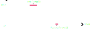

# Wave
The <mark style="color: lightgray; background-color: #191a18">Wave</mark> class significantly streamlines the process of creating periodic animations.

## Defining a wave
<mark style="color: lightgray; background-color: #191a18">Waves</mark> are defined by, and created using, eight different parameters, which are as follows:

- **Upward Curve**: Defines the "shape" of the half of the curve that moves up
- **Downward Curve**: Defines the "shape" of the half of the curve that moves down
- **Up Period**: Defines the amount of time it takes to travel the upward curve
- **Down Period**: Defines the amount of time it takes to travel the downward curve
- **Amplitude**: Defines the maximum value the wave reaches; this is <mark style="color: lightgray; background-color: #191a18">1</mark> by default
- **Crest Wait**: Defines the amount of time the wave maintains its peak
- **Trough Wait**: Defines the amount of time the wave maintains its minimum
- **Uniformity**: Defines how much the offset passed in when evaluating the wave is considered

The following diagram illustrates the first five parameters. On the left you see the upward curve, on the right the downward curve.

The second diagram illustrates crest and trough wait.  
Both essentially insert a period of time during which the wave's value does not change.

The uniformity is hard to visualize in a diagram in this way; I find it easier to just imagine it abstractly as the uniformity the animation will show across the animated text segment.
Below, you see the same animation with the exact same wave, except that the first animation uses uniformity = 0, the second uniformity = 0.25, the third uniformity = 1.

<video class="center"  style="min-width: 300px; max-width: 2000px; width:75%; height:auto;" src="../videos/uniformitydiff.mp4" width="320" height="240" autoplay loop muted>
  Your browser does not support the video tag.
</video>

## Creating a wave
You create a wave simply by passing in these eight values into <mark style="color: lightgray; background-color: #191a18">Waves</mark> constructor.  
Since this class is designed specifically to be used with animations though, likely you will mostly be creating it using the <mark style="color: lightgray; background-color: #191a18">CreateWave</mark>
method from the <mark style="color: lightgray; background-color: #191a18">ParameterUtility</mark> class.
For info about how to use wave as a parameter in your animations, see [ParameterUtility Wave](parameterutility.md#waves).

## Evaluating a wave
Once you have created a <mark style="color: lightgray; background-color: #191a18">Wave</mark>, you can evaluate it using a time value and an offset value: <mark style="color: lightgray; background-color: #191a18">(float, int) Evaluate(float time, float offset)</mark>.  
As you can tell by the signature, <mark style="color: lightgray; background-color: #191a18">Evaluate</mark> returns two values.
The float is the actual value of the curve for the given time and offset.
The integer indicates whether the curve is currently travelling up or down; if it is negative, the curve is moving down, if it is positive, the curve is moving up.
This value is useful for when you want to switch the behavior of your animation depending on what curve the wave is currently travelling.  
For example, the built-in <mark style="color: lightgray; background-color: #191a18">fade</mark> animation can use different anchors depending on whether the character 
is fading in or out. The animation below visualizes how <mark style="color: lightgray; background-color: #191a18">fade</mark> uses both values of the <mark style="color: lightgray; background-color: #191a18">Evaluate</mark>
method.

<video class="center"  style="min-width: 300px; max-width: 2000px; width:75%; height:auto;" src="../videos/fadevalues.mp4" width="320" height="240" autoplay loop muted>
  Your browser does not support the video tag.
</video>

## Checking wave extrema
You can check if the wave passed an extrema (so either the crest or the trough) during the last update, using the <mark style="color: lightgray; background-color: #191a18">int PassedExtrema(float time, float deltaTime, float offset)</mark> method.
Once again, you need the time value and the offset, and additionally here you need the deltaTime since you last checked.
Essentially, the method checks whether the wave passed an extrema during the time interval of [<mark style="color: lightgray; background-color: #191a18">timeValue - deltaTime</mark>, <mark style="color: lightgray; background-color: #191a18">timeValue</mark>]. A positive return value indicates that a maximum was passed, a negative return value indicates that a minimum was passed, and 0 indicates neither was.

An additional, optional parameter is <mark style="color: lightgray; background-color: #191a18">[PulseExtrema](../api/TMPEffects.TMPAnimations.AnimationUtility.Wave.PulseExtrema.yml)</mark>.
If the checked wave has a crest or trough wait, this parameter defines whether an extremum is passed once the wait time begins, or once it ends. <mark style="color: lightgray; background-color: #191a18">PulseExtrema</mark> can also consider both
to be an extrema, but of course be aware that it will then notify you of each extremum twice.

If multiple extrema were passed during the specified interval, it will notify you of the latest one.
