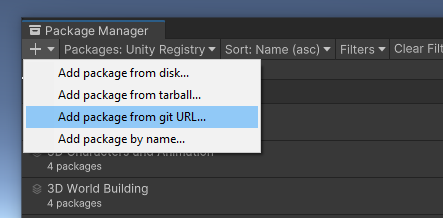

<link rel="stylesheet" type="text/css" href="../styles.css">

# Installation

TMPEffects is available on the [OpenUPM registry](https://openupm.com/).

Alternatively, you can install TMPEffects through the Unity Package Manager, using the git url:  
```console
https://github.com/Luca3317/TMPEffects.git?path=/Package
```

For that, open the Package Manager window in Unity and click on the '+' icon in the top left.



Then, paste the above git url and hit enter. Done!

## Importing Resources
Once installed, when you first access a TMPEffects component, you will be prompted to import the required resources.  
These are the asset files for the built-in animations, commands and databases, as well as a settings file (which you can access through Unity's <mark class="markstyle">Preferences</mark>). They will be imported into <mark class="markstyle">Assets/TMPEffects</mark>.


> [!WARNING]
> :warning: Ideally, you should reload the current scene once you imported these resources, otherwise some asset references might not be correctly updated until
the next domain reload.

After that, you should be good to go :smiley:  
Optionally, there are a few basic samples you can import.
