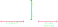
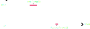

<link rel="stylesheet" type="text/css" href="../styles.css">

# Wave
The <mark class="markstyle">Wave</mark> class significantly streamlines the process of creating periodic animations.  

Be aware it is a valid [AutoParameterBundle](autoparameters.md#bundles).

## Defining a wave
<mark class="markstyle">Waves</mark> are defined by, and created using, eight different parameters, which are as follows:

- **Upward Curve**: Defines the "shape" of the half of the curve that moves up
- **Downward Curve**: Defines the "shape" of the half of the curve that moves down
- **Up Period**: Defines the amount of time it takes to travel the upward curve
- **Down Period**: Defines the amount of time it takes to travel the downward curve
- **Amplitude**: Defines the maximum value the wave reaches; this is <mark class="markstyle">1</mark> by default
- **Crest Wait**: Defines the amount of time the wave maintains its peak
- **Trough Wait**: Defines the amount of time the wave maintains its minimum

The following diagram illustrates the first five parameters. On the left you see the upward curve, on the right the downward curve.

The second diagram illustrates crest and trough wait.  
Both essentially insert a period of time during which the wave's value does not change.

## Wave offsets
In addition to the time value, <mark class="markstyle">Wave's</mark> evaluation methods (see below) accept an offset parameter. This allows you to easily apply the wave
non-uniformly across an animated segment of text. In almost all cases, you will want to get this offset using an [OffsetProvider](offsetproviders.md).  

To visualise, below you see the same animation with the exact same wave, all using the same index-based offset but different uniformities (the uniformity is essentially a simple scalar of the offset).
The first animation uses uniformity = 0, the second uniformity = 0.25, the third uniformity = 1.

<video class="center"  style="min-width: 300px; max-width: 2000px; width:75%; height:auto;" src="../videos/uniformitydiff.mp4" width="320" height="240" autoplay loop muted>
  Your browser does not support the video tag.
</video>

## Evaluating a wave
You can evaluate <mark class="markstyle">Waves</mark> using a time value and an offset value: <mark class="markstyle">(float value, int direction) Evaluate(float time, float offset)</mark>.  
As you can tell by the signature, <mark class="markstyle">Evaluate</mark> returns two values.
<mark class="markstyle">value</mark> is the actual evaluated value of the curve for the given time and offset.
<mark class="markstyle">direction</mark>indicates whether the curve is currently travelling up or down; if it is negative, the curve is moving down, if it is positive, the curve is moving up.
This value is useful for when you want to switch the behavior of your animation depending on what curve the wave is currently travelling.  
For example, the built-in <mark class="markstyle">fade</mark> animation can use different anchors depending on whether the character 
is fading in or out. The animation below visualizes how <mark class="markstyle">fade</mark> uses both values of the <mark class="markstyle">Evaluate</mark>
method.

<video class="center"  style="min-width: 300px; max-width: 2000px; width:75%; height:auto;" src="../videos/fadevalues.mp4" width="320" height="240" autoplay loop muted>
  Your browser does not support the video tag.
</video>

## Checking wave extrema
You can check if the wave passed an extrema (so either the crest or the trough) during the last update, using the <mark class="markstyle">int PassedExtrema(float time, float deltaTime, float offset)</mark> method.
Once again, you need the time value and the offset, and additionally here you need the deltaTime since you last checked.
Essentially, the method checks whether the wave passed an extrema during the time interval of [<mark class="markstyle">timeValue - deltaTime</mark>, <mark class="markstyle">timeValue</mark>]. A positive return value indicates that a maximum was passed, a negative return value indicates that a minimum was passed, and 0 indicates neither was.

An additional, optional parameter is <mark class="markstyle">[PulseExtrema](../api/TMPEffects.TMPAnimations.AnimationUtility.Wave.PulseExtrema.yml)</mark>.
If the checked wave has a crest or trough wait, this parameter defines whether an extremum is passed once the wait time begins, or once it ends. <mark class="markstyle">PulseExtrema</mark> can also consider both
to be an extrema, but of course be aware that it will then notify you of each extremum twice.

If multiple extrema were passed during the specified interval, it will notify you of the latest one.