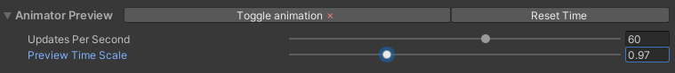

<link rel="stylesheet" type="text/css" href="../styles.css">

# TMPAnimator inspector overview
This section gives an overview of <mark class="markstyle">TMPAnimator's</mark> inspector.

## Preview
To toggle the editor preview of animations, press the <mark class="markstyle">TogglePreview</mark> at the top of the TMPAnimator inspector.
Next to it, the button labeled <mark class="markstyle">Reset time</mark> resets the time tracked by the TMPAnimator component, and therefore all animations.  

If you expand the preview label's foldout, you can set how often the preview is updated and scale the time values used by the preview.

 
 

## Animation databases
Under the <mark class="markstyle">Animations</mark> foldout, you may choose the animation database that is used to process animation tags from the TextMeshPro component's text.
If you toggle <mark class="markstyle">Use default database</mark> to true, the default animation database is automatically selected for you.
The default database is defined in the TMPEffects settings.
You can also set the database used by the TMPAnimator component through script, using the <mark class="markstyle">SetDatabase(TMPAnimationDatabase db)</mark> method.

Below the database, there are three other fields: <mark class="markstyle">SceneAnimations</mark>, <mark class="markstyle">SceneShowAnimations</mark> and <mark class="markstyle">SceneHideAnimations</mark>.
These are simply dictionaries that allow you to map tag names to SceneAnimations. Tags defined here are also parsed by the TMPAnimator.

For more about databases, see [Databases](databases.md). For more about SceneAnimations, see [SceneAnimations](tmpanimator_sceneanimations.md).

## Animator settings
TMPAnimator has various settings.
- Animations override:  
The default override behavior for all animation tags. If true, each tag overrides any of its category (basic / show / hide) that came before it, and only that one is applied. Otherwise, animations are stacked by default. Each tag can manually
define its override behavior by using the <mark class="markstyle">override</mark> (shorthand: <mark class="markstyle">or</mark>) parameter, e.g. <mark class="markstyle">&lt;wave amp=10 or=false&gt;.

- Default animations:  
Allows you to define default animations that are applied to the entirety of the text. Set this like you would add any tag to your text, e.g. <mark class="markstyle">&lt;+fade dur=0.65 anc=a:bottom&gt;</mark>, <mark class="markstyle">&lt;-spread crv=easeinoutsine&gt;</mark>.

- Exclusions:  
For each of the animation categories (basic / show / hide), you can define a set of characters that is excluded from all animations. For example, if you don't want numbers to be animated, you could set <mark class="markstyle">Excluded Characters</mark> to "1234567890". In addition to this, there is an <mark class="markstyle">Exclude Punctuation</mark> toggle for each of the categories.

- Keyword databases:  
You may set the keyword databases used to parse tag parameters. Like with the animation database, there is a toggle to automatically use the database defined in TMPEffects' settings.  
Additionally you may set a <mark class="markstyle">SceneKeywordDatabase</mark>, which is a keyword database that is a component instead of an asset.

## Animation settings
These are settings that specifically change animations.
- Scale animations:  
Defines whether animations should be scaled based on the size of characters. If true, animations will look identical regardless of size.

- Scale uniformly:  
Whether animations should use the TMP_Text component's font size to scale animations or the size of the individual characters.
This is only relevant if you override the font size of some characters using TextMeshPro's <mark class="markstyle">&lt;size&gt;</mark> tag.

- Use scaled time:  
Defines whether animations should use [scaled time](https://docs.unity3d.com/ScriptReference/Time-timeScale.html) or not.