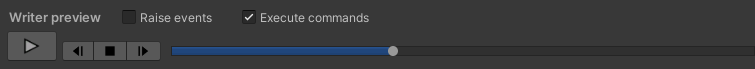

<link rel="stylesheet" type="text/css" href="../styles.css">

# TMPWriter overview
This section gives an overview of the <mark class="markstyle">TMPWriter's</mark> inspector.

## Preview
To preview the writer in editor mode, you can hit the play button in the <mark class="markstyle">Writer preview</mark> section at the top of the TMPWriter inspector.
Right next to it, are the buttons for resetting, stopping, and skipping the writer respectively.
The progress bar lets you freely skip to any point of the writing process.

The two toggles above the player decide whether events and commands are executed in the editor preview.
There is a few things to consider with them:

Event toggle
- You will also have to set the actual events you want to raise to <mark class="markstyle">Editor and Runtime</mark>.

> [!WARNING] 
> :warning: Be careful about which events you allow to be raised in preview mode. Generally I'd recommend setting the event toggle to false completely.

Command toggle
- <mark class="markstyle">SceneCommands</mark> are never raised in preview mode.
- If you create any new commands, you can decide whether it should be raised in preview mode through its <mark class="markstyle">ExecuteInPreview</mark> property.

 
 

## Delays
You may set the delay between showing each character in the inspector. If you expand the delay foldout, you may also set the delays for whitespace characters, linebreak characters, punctuation characters, and characters that were already visible (which may be the case if a character is set to visible manually in some script or when using the <mark class="markstyle">&lt;show&gt;</mark> tag).
Each of those more specific delays you may set either as a percentage of the general delay or as raw value.

## Command databases
The TMPWriter inspector has a foldout labeled <mark class="markstyle">Commands</mark>.
There, you may choose the command database that is used to process command tags from the TextMeshPro component's text.
If you toggle <mark class="markstyle">Use default database</mark> to true, the default command database is automatically selected for you.
The default database is defined in the TMPEffects settings.

Below the database, there is another field, <mark class="markstyle">SceneCommands</mark>, which is simply a dictionary that allows you to map tag names to SceneCommands. Tags defined here are also parsed by the TMPWriter.

For more about databases, see [Databases](databases.md). For more about SceneCommands, see [SceneCommands](tmpwriter_scenecommands.md).

## Writer settings
This foldout contains some simple toggles.
- Write on start:  
Whether to automatically begin writing when the <mark class="markstyle">TMPWriter</mark> is first enabled.

- Write on new text:  
Whether to automatically begin writing whenever the text is changed.

- May skip:  
Whether text may be skipped by default.

- Use scaled time:  
Whether the delay between showing characters, and potential wait operations, should use scaled or unscaled time.

Besides the toggles, you may set the keyword databases used to parse tag parameters. Like with the command database, there is a toggle to automatically use the database defined in TMPEffects' settings.  
Additionally you may set a <mark class="markstyle">SceneKeywordDatabase</mark>, which is a keyword database that is a component instead of an asset.

## Writer events
Besides the OnTextEvent (see [Getting started](tmpwriter_gettingstarted.md)), there are the following events you may listen to:

- **OnCharacterShown(CharData cData)**: Raised whenever the writer shows a new character; passes the newly shown character
- **OnStartWriter()**: Raised whenever the writing process is started
- **OnStopWriter()**: Raised whenever the writing process is stopped
- **OnResetWriter(int index)**: Raised whenever the writing process is reset; passes the index that was reset to
- **OnResetWriter(int index)**: Raised whenever the writing process is skipped; passes the index that was skipped to
- **OnFinishWriter()**: Raised whenever the writing process is finished, and the whole text is shown