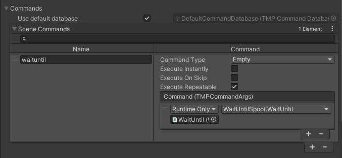

<link rel="stylesheet" type="text/css" href="../styles.css">

# Scene commands
In addition to <mark class="markstyle">TMPCommand</mark>, which the commands we've seen so far derive from and which are stored on disk, there is also the <mark class="markstyle">SceneCommand</mark> type.
It allows you to call any method of your scene objects.

## Adding scene commands

When you add a new element to the <mark class="markstyle">SceneCommands</mark> dictionary found in TMPWriter's <mark class="markstyle">Commands</mark> foldout, you will see  
an empty field <mark class="markstyle">Name</mark> on the left side. Here you can assign a name to reference the command with.  
On the right, in UnityEvent field, you can simply drag any GameObject and choose the method to call when this command is invoked.  
The example creates a <mark class="markstyle">SceneCommand</mark> called "waituntil", which calls a method "WaitUntil(TMPCommandArgs args)".

## Using scene commands
<mark class="markstyle">SceneCommands</mark> are applied in the exact same way as their respective counterpart: <mark class="markstyle">SceneCommand</mark> tags can be directly inserted into the text, with a '!' prefix.